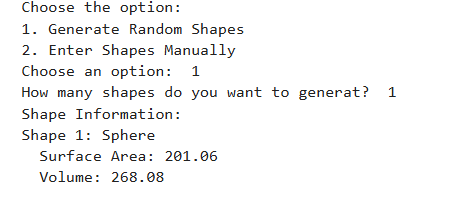
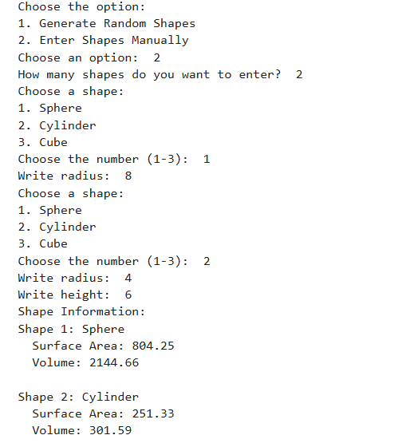

# Explanation

## General idea:

### The program calculates the area and volume of three shapes: sphere, cylinder and cube. But before detailing their formula, these subclasses "inherit" abstract methods from a superclass (Shape3d).

## Workflow:

### The user can choose to do one of two things first: watch the program calculate the area and volume of a random shape by itself. For example,

### Or he can decide for himself the area and volume of the shape he wants. And it is also possible to find the values of several different figures. For example,

